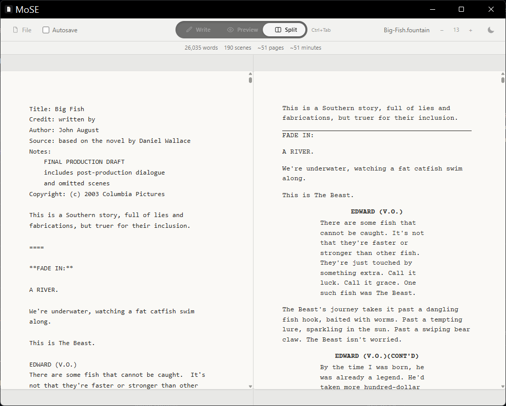

# Movie Script Editor

> 🤖 **AI Dev Project** — This application was built through an agentic, AI-assisted development workflow using **Claude (Sonnet 5)** by Anthropic. I directed the architecture, feature scoping, debugging, and review; Claude wrote the implementation. See [Development Notes](#development-notes) below for details on the process.

A distraction-free desktop screenwriting editor built around the [Fountain](https://fountain.io/) format — write in plain text, see it rendered like a real screenplay.



## Features

- **Write / Preview / Split views** — write in plain Fountain markup, see a properly formatted screenplay preview, or view both side by side (`Ctrl+Tab` to cycle)
- **Standard Fountain formatting** — scene headings, transitions, character/dialogue blocks, parentheticals, and centered text rendered per screenplay convention
- **Export to PDF** — industry-standard margins (1.5" binding edge), Courier Prime font, and a proper title page generated from the script's Fountain metadata
- **Live screenplay stats** — word count, scene count, and estimated page/runtime (55-lines-per-page heuristic)
- **Find in editor** — `Ctrl+F` to search, next/prev navigation, live match count
- **Autosave** — opt-in, debounced writes to disk once a file has been saved at least once
- **Draft recovery** — unsaved content and the last opened file are restored automatically on relaunch
- **External change detection** — prompts to reload if the open file changes outside the app
- **Light/dark theme and adjustable font size**, both persisted across sessions
- **Native file menu, keyboard shortcuts, and quit-confirmation** for unsaved changes

## Tech Stack

- [Electron](https://www.electronjs.org/) + [React](https://react.dev/) + [TypeScript](https://www.typescriptlang.org/)
- [Vite](https://vite.dev/) for bundling
- [Tailwind CSS](https://tailwindcss.com/) for styling
- [fountain-js](https://github.com/jonnygreenwald/fountain-js) for Fountain parsing/rendering

## Getting Started

```bash
git clone https://github.com/<your-username>/movie-script-editor.git
cd movie-script-editor
npm install
npm run dev
```

### Building a desktop installer

```bash
npm run build
npm run package
```

Output installer is written to `release/`.

## Testing

```bash
npm run test       # unit tests (Vitest)
npm run test:e2e   # end-to-end tests (Playwright + Electron)
```

Unit tests cover Fountain parsing, document/settings state, and persistence logic. E2E tests cover core app flows: launch, draft persistence, preview rendering, and theme persistence.

## Development Notes

This project was built collaboratively with [Claude](https://claude.com), using an agent-assisted development workflow — the working `AGENTS.md` in this repo captures the conventions and guardrails used throughout the build (architecture decisions, coding conventions, and non-goals for the project).

## License

MIT
